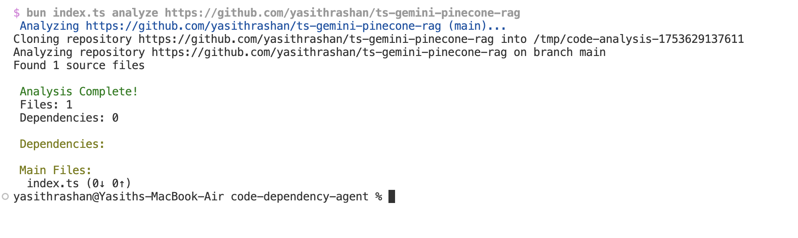
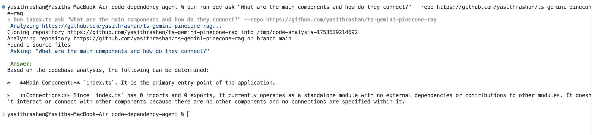

# Code Dependency Agent

A powerful TypeScript AST-powered dependency analyzer for GitHub repositories with AI-driven insights using Google Gemini.

## Features

- **AST-Powered Analysis**: Uses TypeScript compiler API for accurate parsing
- **GitHub Integration**: Clone and analyze any public repository
- **Multi-Language Support**: TypeScript, JavaScript, TSX, JSX files
- **AI Insights**: Ask questions about codebase architecture using Gemini AI
- **Dependency Mapping**: Extract and visualize import/export relationships
- **Clean CLI Interface**: Simple commands for analysis and querying

## Installation

### Prerequisites
- [Bun](https://bun.sh/) runtime
- [Gemini API Key](https://makersuite.google.com/app/apikey)

### Setup

```bash
# Clone the repository
git clone https://github.com/yasithrashan/code-dependency-agent

# Install dependencies
bun install

# Setup environment
cp .env.example .env
# Add your GEMINI_API_KEY to .env
```

## Usage

### Analyze a Repository

```bash
# Analyze any GitHub repository
bun run dev analyze https://github.com/microsoft/vscode

# Analyze specific branch
bun run dev analyze https://github.com/nestjs/nest --branch develop
```

**Sample Output:**


### Ask AI Questions

```bash
# Get AI insights about the codebase
bun run dev ask "What is the main architecture pattern?" --repo https://github.com/nestjs/nest

# Ask about specific functionality
bun run dev ask "How does the authentication system work?" --repo https://github.com/your-org/your-repo
```

**Sample AI Response:**

## Project Structure

```
code-dependency-agent/
├── src/
│   ├── cli/
│   │   └── index.ts          # CLI entry point
│   ├── core/
│   │   ├── analyzer.ts       # AST-powered analysis engine
│   │   └── types.ts          # Type definitions
│   └── services/
│       └── gemini.ts         # AI integration service
├── docs/
│   └── resources/            # Documentation assets
├── package.json              # Dependencies and scripts
├── tsconfig.json             # TypeScript configuration
├── .env.example              # Environment template
└── README.md                 # This file
```

## CLI Commands

### Help
```bash
bun run dev --help
bun run dev analyze --help
bun run dev ask --help
```

### Analyze Command
```bash
bun run dev analyze https://github.com/yasithrashan/code-dependency-agent [options]

Options:
  -b, --branch <branch>  Branch to analyze (default: "main")
  -h, --help            Display help for command
```

### Ask Command
```bash
bun run dev ask <question> [options]

Options:
  -r, --repo https://github.com/yasithrashan/code-dependency-agent  GitHub repository URL
  -h, --help            Display help for command
```

## What It Analyzes

- **Import Statements**: `import { Component } from './component'`
- **Export Declarations**: `export class Service`, `export default function`
- **File Dependencies**: Maps relationships between modules
- **Code Structure**: Identifies classes, functions, interfaces
- **Architecture Patterns**: AI detects common patterns and practices

## Technical Details

### AST Parsing
Uses TypeScript Compiler API (`typescript` package) for:
- Accurate syntax tree parsing
- Import/export extraction
- Type-aware analysis
- Support for modern JS/TS features

### Supported Files
- `.ts` - TypeScript files
- `.tsx` - TypeScript React files
- `.js` - JavaScript files
- `.jsx` - JavaScript React files
- Excludes `.d.ts` definition files

### Filtering
Automatically skips:
- `node_modules/`
- `dist/` and `build/`
- `.git/` directory
- Common build artifacts

## AI Integration

Powered by Google Gemini AI for:
- **Architecture Analysis**: Understand code patterns and structure
- **Dependency Explanations**: Get insights about module relationships
- **Code Quality Assessment**: Identify potential improvements
- **Documentation Generation**: Auto-generate architecture docs

## Environment Variables

```bash
# Required
GEMINI_API_KEY=your_gemini_api_key_here
```

Get your API key from [Google AI Studio](https://makersuite.google.com/app/apikey)

## Example Workflows

### 1. Analyze New Codebase
```bash
# Quick overview of unknown repository
bun run dev analyze https://github.com/vercel/next.js

# Ask about architecture
bun run dev ask "What are the main components and how do they interact?" --repo https://github.com/vercel/next.js
```

### 2. Code Review Assistance
```bash
# Understand specific patterns
bun run dev ask "How is error handling implemented?" --repo https://github.com/your-org/project

# Check dependencies
bun run dev ask "What external libraries are heavily used?" --repo https://github.com/your-org/project
```

### 3. Learning from Open Source
```bash
# Study popular projects
bun run dev analyze https://github.com/facebook/react
bun run dev ask "What design patterns does React use internally?" --repo https://github.com/facebook/react
```

## Limitations

- **Public Repositories Only**: Requires public GitHub repos (or proper Git access)
- **Rate Limits**: Subject to Gemini API rate limits
- **Large Repositories**: May take time to clone and analyze very large codebases
- **Network Dependency**: Requires internet for GitHub cloning and AI queries

## Contributing

1. Fork the repository
2. Create a feature branch
3. Make your changes
4. Add tests if applicable
5. Submit a pull request

## License

MIT License - see LICENSE file for details

## Links

- [TypeScript Compiler API](https://github.com/microsoft/TypeScript/wiki/Using-the-Compiler-API)
- [Google Gemini AI](https://ai.google.dev/)
- [Bun Runtime](https://bun.sh/)

---

**Made with TypeScript AST magic**